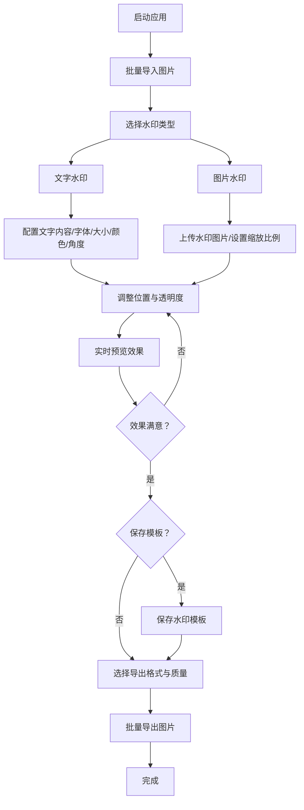

## 1. 产品概述

本地图片批量加水印工具——一款基于 Electron 的桌面应用，所有图片处理均在本地完成，保护用户隐私。面向摄影师、设计师、电商运营等需要批量给图片添加水印的用户群体，解决手动逐张加水印效率低下的问题。

- 主旨：极简科技风本地批量水印工具，零云端依赖，极速处理
- 价值：提升批量图片水印处理效率 10 倍以上，确保图片数据不离开用户设备

## 2. 核心功能

### 2.1 用户角色

| 角色 | 说明 |
|------|------|
| 本地用户 | 所有功能均面向单一本地用户，无需注册登录 |

### 2.2 功能模块

1. **主工作台**：图片导入区、图片预览列表、水印配置面板、实时预览、批量导出
2. **水印模板管理**：模板保存、模板加载、模板删除

### 2.3 页面详情

| 页面名称 | 模块名称 | 功能描述 |
|----------|----------|----------|
| 主工作台 | 图片导入区 | 支持拖拽导入和点击选择，批量导入图片文件（JPG/PNG/WebP/BMP），显示导入数量和总大小 |
| 主工作台 | 图片预览列表 | 缩略图网格展示已导入图片，支持单选/多选/全选，显示文件名和尺寸信息，支持删除单张或清空 |
| 主工作台 | 水印配置面板 | 文字水印设置（内容、字体、大小、颜色、旋转角度）、图片水印设置（上传水印图片、缩放比例）、位置选择（9宫格预设+自定义坐标）、透明度滑块调节 |
| 主工作台 | 实时预览区 | 在当前选中图片上实时渲染水印效果，支持缩放查看细节 |
| 主工作台 | 批量导出 | 导出格式选择（PNG/JPG/WebP）、质量设置、输出目录选择、导出进度条、一键批量导出 |
| 水印模板管理 | 模板保存 | 将当前水印配置保存为命名模板（含文字/图片水印参数、位置、透明度） |
| 水印模板管理 | 模板加载 | 从模板列表选择加载配置，一键应用 |
| 水印模板管理 | 模板删除 | 删除不需要的模板 |

## 3. 核心流程

用户打开应用 → 批量导入图片 → 配置水印参数（文字/图片）→ 调整位置和透明度 → 实时预览效果 → 保存水印模板（可选）→ 选择导出格式和质量 → 批量导出处理后的图片

## 4. 用户界面设计

### 4.1 设计风格

- **主色调**：黑色（#0A0A0A）+ 白色（#FFFFFF）+ 青色（#00E5CC）
- **辅助色**：深灰（#1A1A2E）、浅灰（#2A2A3E）、暗青（#00B3A0）
- **按钮风格**：圆角矩形，青色主操作按钮带微光效果，灰色次操作按钮
- **字体**：标题使用等宽科技感字体（JetBrains Mono / Fira Code），正文使用系统字体
- **布局风格**：左右分栏，左侧图片列表，右侧配置面板，顶部工具栏，暗色主题
- **图标风格**：线性图标（Lucide），青色高亮
- **特效**：卡片悬浮微光边框、按钮点击波纹、进度条流光动画、面板切换过渡

### 4.2 页面设计概览

| 页面名称 | 模块名称 | UI 元素 |
|----------|----------|---------|
| 主工作台 | 顶部工具栏 | 深色背景，应用Logo + 导入按钮 + 模板按钮 + 导出按钮，青色点缀 |
| 主工作台 | 左侧图片列表 | 深灰背景，缩略图网格（带悬浮高亮），底部状态栏显示图片数量 |
| 主工作台 | 中间预览区 | 黑色背景，居中图片预览，水印叠加渲染，底部缩放控制 |
| 主工作台 | 右侧配置面板 | 深灰背景，分标签页（文字水印/图片水印/位置/导出），青色滑块和选择器 |
| 主工作台 | 导出弹窗 | 模态对话框，格式选择、质量滑块、目录选择、进度条 |

### 4.3 响应式设计

- 桌面端优先（Electron 桌面应用）
- 最小窗口宽度 1024px
- 面板可折叠适应不同屏幕宽度

### 4.4 3D 场景指导

不适用
