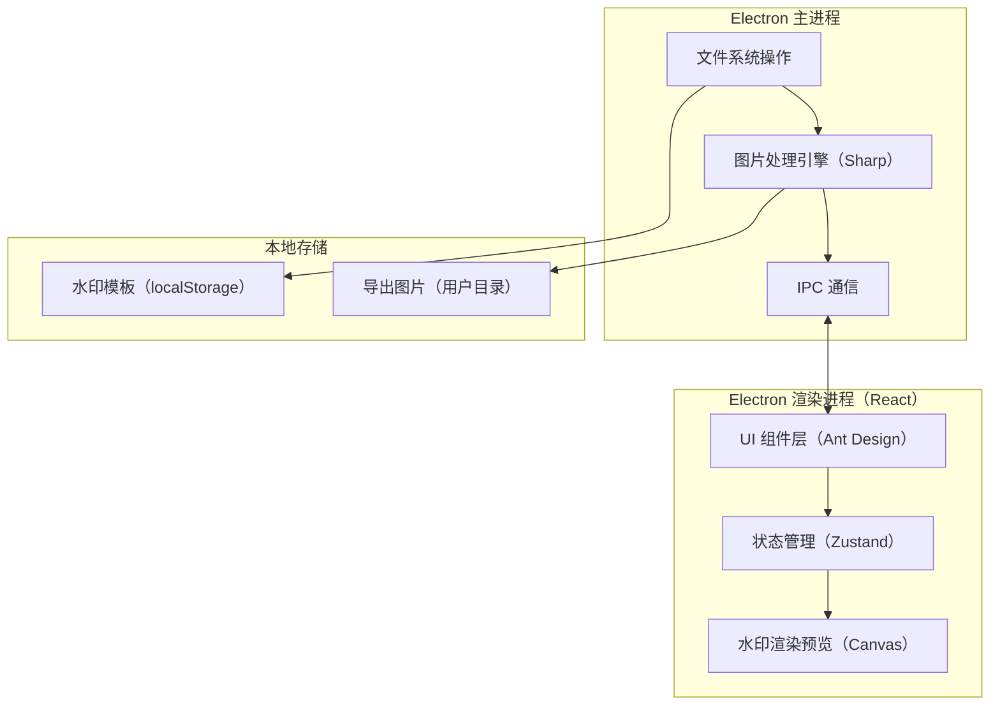
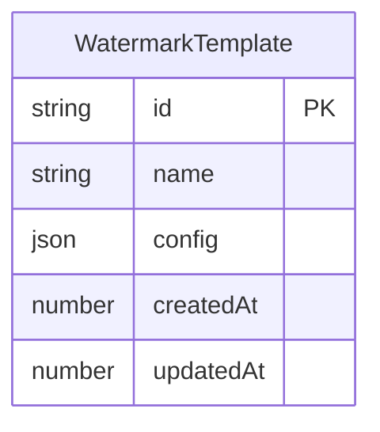

## 1. 架构设计



## 2. 技术说明

- **桌面框架**：Electron@28 + electron-builder 打包
- **前端框架**：React@18 + TypeScript
- **UI 组件库**：Ant Design@5（暗色主题定制）
- **构建工具**：Vite + electron-vite
- **图片处理**：Sharp（Node.js 原生图片处理库，高性能批量处理）
- **状态管理**：Zustand
- **样式方案**：Tailwind CSS + Ant Design Token 定制
- **初始化工具**：vite-init（react-ts 模板）
- **后端**：无独立后端，Electron 主进程承担文件操作和图片处理
- **数据库**：无数据库，水印模板存储在 localStorage

## 3. 路由定义

| 路由 | 用途 |
|------|------|
| / | 主工作台页面，包含所有核心功能 |

## 4. API 定义（Electron IPC 通道）

| IPC 通道 | 方向 | 参数 | 返回值 | 说明 |
|----------|------|------|--------|------|
| import-images | 渲染→主 | filePaths: string[] | ImageInfo[] | 导入图片并获取元信息 |
| add-text-watermark | 渲染→主 | config: TextWatermarkConfig, imagePaths: string[] | Buffer[] | 批量添加文字水印 |
| add-image-watermark | 渲染→主 | config: ImageWatermarkConfig, imagePaths: string[] | Buffer[] | 批量添加图片水印 |
| export-images | 渲染→主 | config: ExportConfig, items: ExportItem[] | ExportResult | 批量导出图片 |
| select-directory | 渲染→主 | 无 | string \| null | 选择输出目录 |
| select-files | 渲染→主 | filters: FileFilter | string[] | 选择文件 |
| get-preview | 渲染→主 | imagePath: string, watermarkConfig: WatermarkConfig | string (base64) | 获取预览图 |

### TypeScript 类型定义

```typescript
interface ImageInfo {
  id: string;
  path: string;
  name: string;
  width: number;
  height: number;
  size: number;
  type: string;
  thumbnail: string;
}

interface TextWatermarkConfig {
  text: string;
  fontFamily: string;
  fontSize: number;
  color: string;
  opacity: number;
  rotation: number;
  position: Position;
}

interface ImageWatermarkConfig {
  imagePath: string;
  scale: number;
  opacity: number;
  position: Position;
}

interface Position {
  x: number;
  y: number;
  preset: 'top-left' | 'top-center' | 'top-right' | 'center-left' | 'center' | 'center-right' | 'bottom-left' | 'bottom-center' | 'bottom-right' | 'custom';
}

interface WatermarkConfig {
  type: 'text' | 'image';
  textConfig?: TextWatermarkConfig;
  imageConfig?: ImageWatermarkConfig;
}

interface ExportConfig {
  format: 'png' | 'jpg' | 'webp';
  quality: number;
  outputDir: string;
}

interface ExportItem {
  imagePath: string;
  watermarkConfig: WatermarkConfig;
}

interface ExportResult {
  total: number;
  success: number;
  failed: number;
  errors: string[];
}

interface WatermarkTemplate {
  id: string;
  name: string;
  config: WatermarkConfig;
  createdAt: number;
  updatedAt: number;
}
```

## 5. 服务端架构图

不适用（纯本地应用，无独立后端服务）

## 6. 数据模型

### 6.1 数据模型定义



### 6.2 数据定义语言

水印模板存储在 localStorage，数据结构为 `WatermarkTemplate[]` 的 JSON 序列化字符串，键名为 `watermark_templates`。
